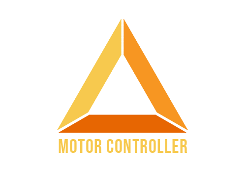

	
	 
	 
	 

	<b>Description</b>
    
Motor-Controller is a set of prefabs to get your 3D game up and running quickly with a Movement state machine that can be built upon for extra character states

	This project is supported by Epitome and its <a href="https://www.patreon.com/epitomegames">patrons</a>&nbsp;&nbsp;&nbsp;

	<b>Follow me on my <a href="https://www.youtube.com/channel/UCsaXQNLxeHvwJdDUrICGufA">Youtube channel</a> for updates</b>

 
 

## Packages used
- Cinemachine
- New Input System

## Available Prefab
- First Person Controller
- Third Person Controller

## Available States
- [Walking](#walking)
- [Jumping](#jumping)
- [Falling](#falling)

## Available Cameras
- [First Person](#firstPerson)

## Currently working on
- Sliding state
- Third Person Camera
- Animator Integration for all states

## Setting up
**To get the bare minimum going, you will need to make sure :**
- The cinemachine package is installed
- There is a Camera tagged as "MainCamera" in your scene
- The Cinemachine "Follow" field is filled in with your Motor of choice
- You have a Motor in the scene

## Features
- Ground check using raycast
- Air influence when jumping
- Follow Ground Vector

## STATES ##

# Walking

- tbw

# Jumping

- tbw

# Falling

- tbw
